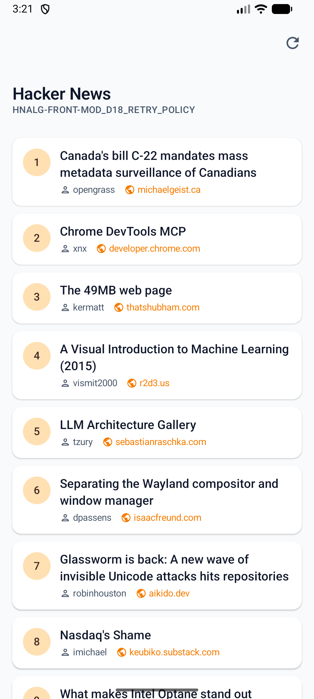
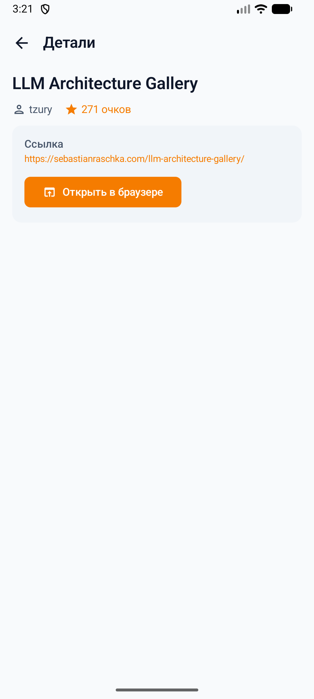
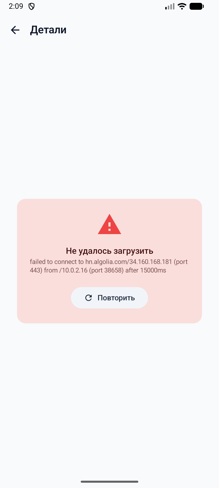

<<<<<<< HEAD
# Komissia Android App

## VariantCode
HNALG-FRONT-MOD_D18_RETRY_POLICY

## Stack
- Kotlin
- Jetpack Compose
- Coroutines
- Retrofit
- Hilt (DI)

## API
Hacker News Search API (Algolia)

Base URL:
https://hn.algolia.com/api/v1

## Endpoints used

List (front page):
/search?tags=front_page

Detail:
/items/{id}

## Modifier

MOD_D18_RETRY_POLICY

При сетевой ошибке реализована политика повторных запросов:

1. Один автоматический повтор запроса через delay
2. Если ошибка остаётся — пользователю показывается кнопка "Retry"

## Features

- Story list (front page)
- Story detail screen
- Navigation between screens
- Loading / Content / Error states
- Retry button for network errors

## Screenshots

### Story List


### Story Detail


=======
# Komissia

**VariantCode:** `HNALG-FRONT-MOD\_D18\_RETRY\_POLICY`

## Что за приложение

Приложение показывает новости с главной страницы Hacker News. Данные берутся через Algolia Search API — публичный read-only API без авторизации.

На первом экране — список статей (front page). Нажимаешь на статью — открывается экран деталей, который грузит подробности отдельным запросом по id.

## Эндпоинты

|Что|Эндпоинт|
|-|-|
|Список новостей (front page)|`GET https://hn.algolia.com/api/v1/search?tags=front\_page`|
|Детали статьи по id|`GET https://hn.algolia.com/api/v1/items/{id}`|

## Модификатор — Retry Policy (MOD\_D18)

По ТЗ: «при ошибке 1 автоповтор через delay + потом кнопка».

Реализация:

1. **Автоповтор на уровне OkHttp** — `RetryInterceptor` перехватывает каждый запрос. Если запрос упал (IOException или HTTP-ошибка), интерсептор ждёт **2 секунды** и автоматически делает **1 повтор**. Пользователь этого не видит — всё происходит прозрачно.
2. **Кнопка Retry в UI** — если и после автоповтора запрос не прошёл, ошибка пробрасывается в ViewModel. Пользователь видит экран с понятным сообщением и кнопкой **«Повторить»**. Нажатие сбрасывает ошибку, переключает UI в Loading и запускает запрос заново.

## Стек

* Kotlin + Jetpack Compose + Coroutines
* MVVM (ViewModel → Repository → Retrofit)
* Hilt (DI)
* Retrofit + OkHttp + Gson
* Jetpack Navigation Compose

## Архитектура

```
com.example.komissia/
├── data/
│   ├── remote/      — Retrofit-сервис, DTO (StoryDto, ItemDto), RetryInterceptor
│   ├── model/       — Доменные модели (Story, StoryDetail)
│   ├── mapper/      — Маппинг DTO → доменные модели
│   └── repository/  — MainRepository (safeCall, CancellationException)
├── di/              — Hilt-модуль (OkHttp, Retrofit, ApiService)
└── ui/
    ├── viewmodel/   — MainViewModel, sealed state (ListScreenState, DetailScreenState)
    ├── screen/      — StoryListScreen, DetailScreen
    ├── navigation/  — NavGraph
    └── theme/       — Тема, палитра, типографика
```

Ключевое:

* DTO не выходят за пределы data-слоя — маппим через `StoryMapper`
* Состояния экранов: `sealed interface` (Loading / Content / Error)
* Стейт списка собирается через `combine` из трёх Flow
* `CancellationException` пробрасывается чтобы не ломать structured concurrency

## Скриншоты

### Список новостей



### Детали статьи



### Ошибка + Retry


>>>>>>> 2d615af0fbb6b07834f9cfa811a32c2319e7c5af
